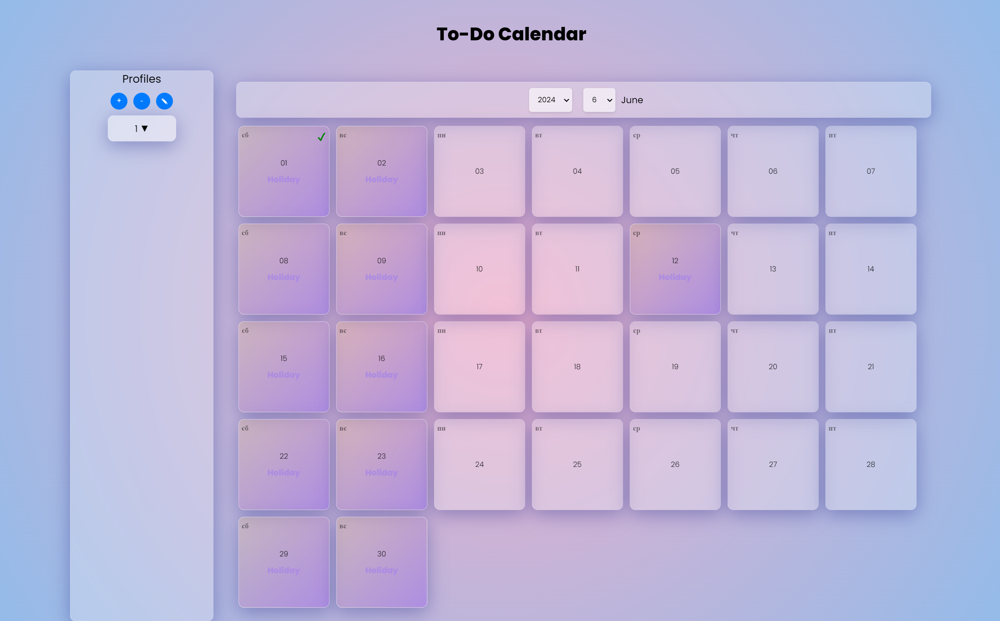

# To-Do Calendar

## Обзор

To-Do Calendar — это веб-приложение, позволяющее пользователям управлять своими задачами с помощью календаря. Приложение поддерживает несколько профилей пользователей, что позволяет каждому пользователю вести отдельный список задач.

## Основные компоненты и функции

### Компоненты

- **AddProfileModal**: Модальный компонент для добавления или редактирования профилей пользователей.
- **Calendar**: Основной компонент календаря, отображающий дни и управляемый задачами.
- **Day**: Представляет один день в календаре, показывая задачи и праздники.
- **Modal**: Общий модальный компонент для отображения задач и форм.
- **ProfileSwitcher**: Выпадающий компонент для переключения между профилями пользователей.
- **TaskForm**: Форма для добавления новых задач на определенный день.
- **TaskItem**: Отображает отдельную задачу с возможностью отметить выполнение или удалить.
- **TaskList**: Список всех задач на заданный день.

### Провайдеры контекста

- **ProfileContext**: Управляет профилями пользователей, включая добавление, редактирование, удаление и переключение профилей.
- **TaskContext**: Управляет задачами, включая добавление, переключение выполнения и удаление задач.

### Хуки

- **useFetchHolidays**: Получает данные о праздниках за указанный год и месяц с помощью API isDayOff.

### Сервисы

- **IsDayOffApi**: Получает данные о праздниках с API isDayOff.
- **AxiosHttpClient**: Реализация HTTP-клиента на основе Axios.
- **HttpClient**: Интерфейс для реализации HTTP-клиентов.

### Утилиты

- **localStorage**: Функции для получения и сохранения задач в localStorage.

## Технологии и их использование

- **React**: JavaScript-библиотека для создания пользовательских интерфейсов.
- **TypeScript**: Надстройка над JavaScript, добавляющая статическую типизацию.
- **SCSS**: Препроцессор CSS для написания более поддерживаемого и масштабируемого стиля.
- **Axios**: Клиент для HTTP-запросов на основе промисов.
- **Jest**: Фреймворк для тестирования JavaScript.
- **Testing Library**: Инструмент для тестирования React-компонентов.
- **Docker**: Платформа для разработки, доставки и запуска приложений в контейнерах.

## Начало работы

### Предварительные требования

- Установлены Node.js и npm.
- Установлен Docker.

### Установка

1. Клонируйте репозиторий:

   **git clone https://github.com/Chuppy101/Todo_Calendar.git**
   **cd todo_calendar**

2. Установите зависимости:

**npm install**

## Запуск приложения

### Для локального запуска приложения:

**npm start**

### Запуск в Docker

1. Соберите Docker-образ:

**docker build -t todo_calendar .**

2. Запустите контейнер Docker:

**docker run -p 3000:3000 todo_calendar**

### Остановка контейнера

Чтобы остановить запущенный контейнер, выполните команду:

**docker stop <container_id>**

Вы можете узнать container_id с помощью команды:

**docker ps**

## Запуск тестов

Для запуска тестов:

**npm test**

## Демонстрация проекта

Этот проект демонстрирует использование современных веб-технологий для создания функционального и удобного приложения для управления задачами с календарным представлением.
